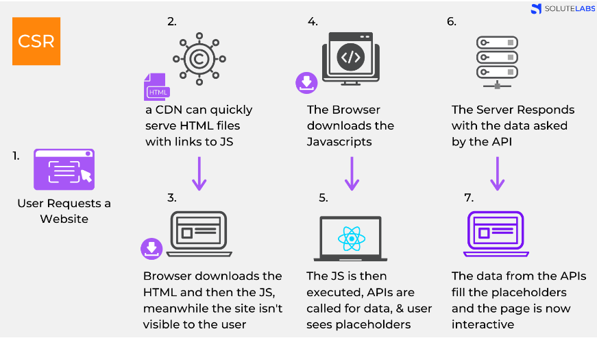

# Server Side Rendering(SSR)

    - Server-side rendering (SSR) is a technique that renders a web page on the server rather than in the browser. 
    
    - When a website's JavaScript is rendered on the website's server, a fully rendered page is sent to the client and the client's JavaScript bundle engages and enables the Single Page Application framework to operate.



### Ways of achieving the SSR : 

#### Way 1 : Sending HTML inside a string
```javascript
app.get("/", (req, res) => {
    res.send("<h1>Hello Amith!!!</h1>");
});
```
__NOTE :__ This is not an efficient method the send HTML to the client.

#### Way 2 : To solve the above issuse , we have templating engines, for example 
    1) EJS - Embeded JavaScript templating
    2) PUG.js
    3) handlebars

### We will be using EJS : 
__Step 1 :__ Installing ejs package
```bash
npm install ejs@3.1.6
```

__Step 2 :__ Configuring with index.js
```javascript
var express = require('express');
var app = express();

// set the view engine to ejs
app.set('view engine', 'ejs');

// use res.render to load up an ejs view file

// index page
app.get('/', function(req, res) {
  res.render('pages/index');
});

// about page
app.get('/about', function(req, res) {
  res.render('pages/about');
});

app.listen(8080);
console.log('Server is listening on port 8080');
```

__NOTE__ : This code also sets EJS as the view engine for the Express application using:
```javascript
`app.set('view engine', 'ejs');`
```