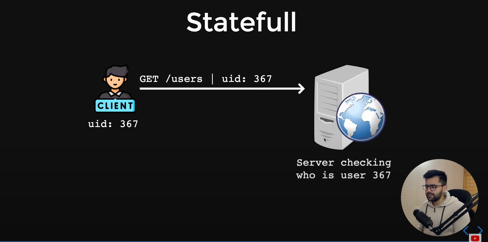
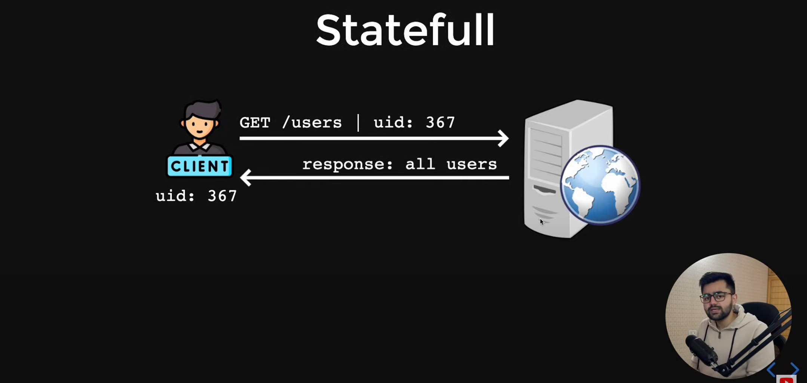
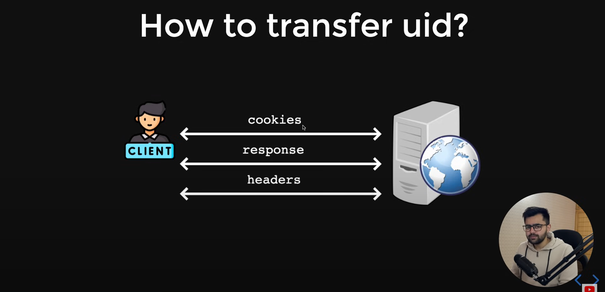
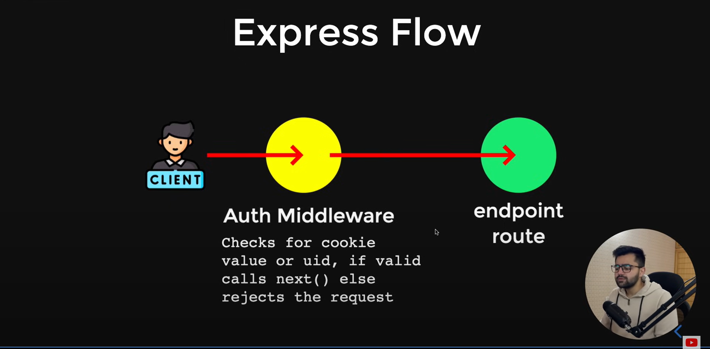

# Authentication in Express.js

### Authentication patterns 
1) Statefull : Which maintains state or data on server side.

### Working of Statefull authentication : 

### Express authentication flow : 

2) Stateless : Which has no state.
Example : JWT Tokens(Next topic)